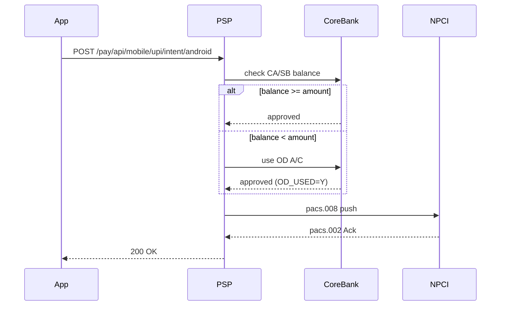

```mermaid
sequenceDiagram
    participant App
    participant PSP
    participant CoreBank
    participant NPCI
    App->>PSP: POST /pay/api/mobile/upi/intent/android
    PSP->>CoreBank: check CA/SB balance
    alt balance >= amount
        CoreBank-->>PSP: approved
    else balance < amount
        PSP->>CoreBank: use OD A/C
        CoreBank-->>PSP: approved (OD_USED=Y)
    end
    PSP->>NPCI: pacs.008 push
    NPCI-->>PSP: pacs.002 Ack
    PSP-->>App: 200 OK
```
