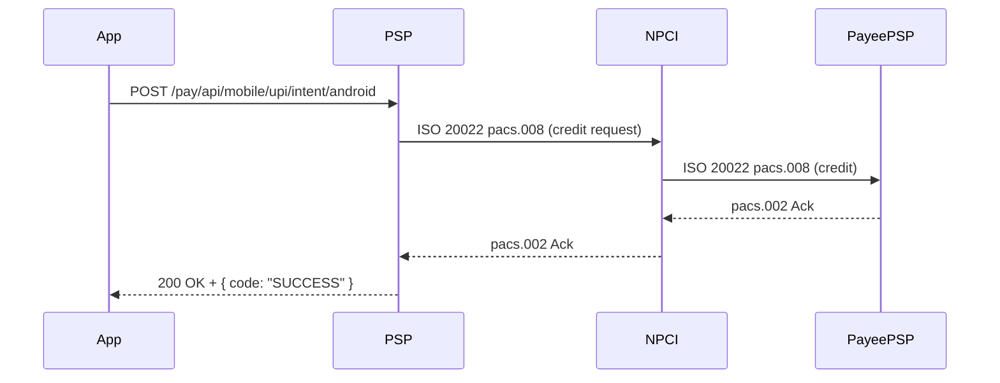

```mermaid
sequenceDiagram
    participant App
    participant PSP
    participant NPCI
    participant PayeePSP
    App->>PSP: POST /pay/api/mobile/upi/intent/android
    PSP->>NPCI: ISO 20022 pacs.008 (credit request)
    NPCI->>PayeePSP: ISO 20022 pacs.008 (credit)
    PayeePSP-->>NPCI: pacs.002 Ack
    NPCI-->>PSP: pacs.002 Ack
    PSP-->>App: 200 OK + { code: "SUCCESS" }
```
