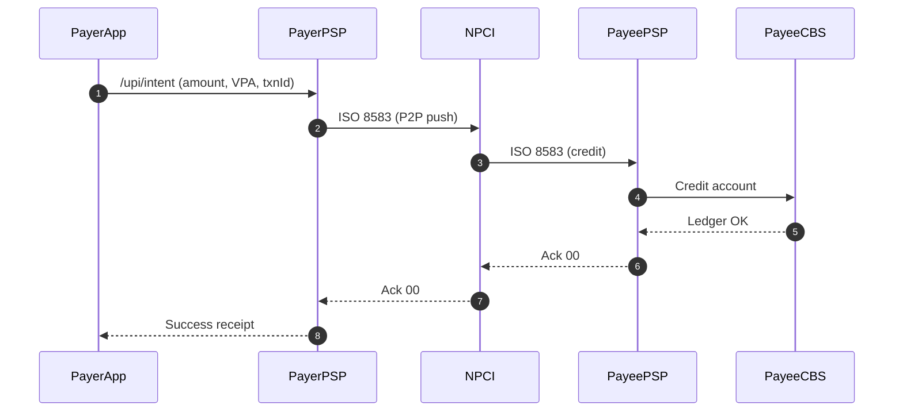
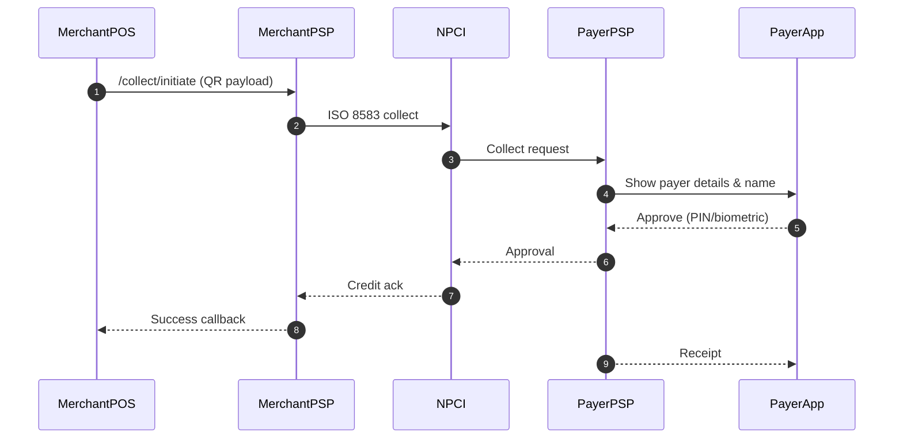
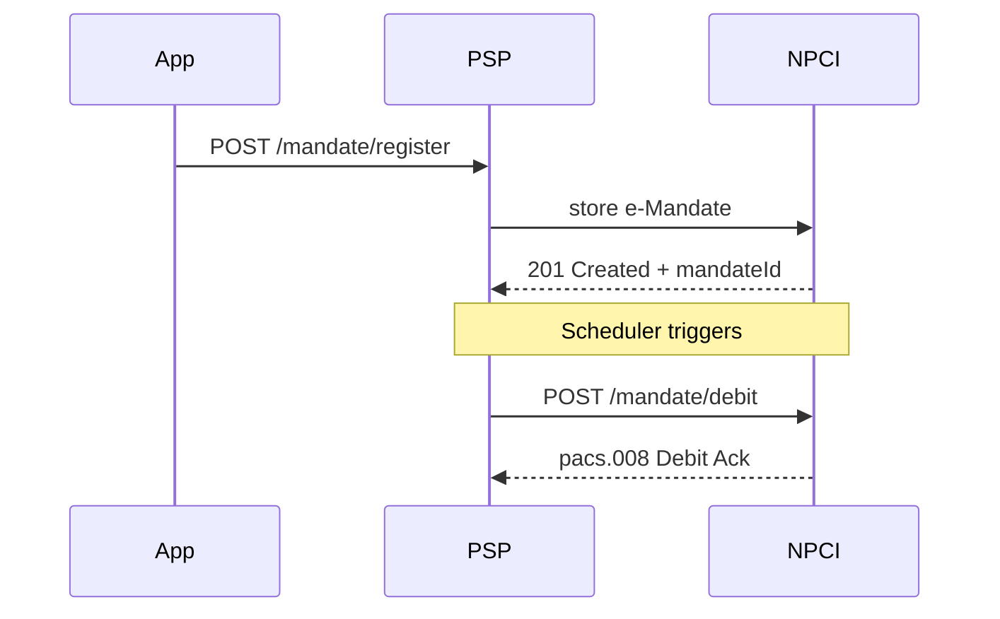
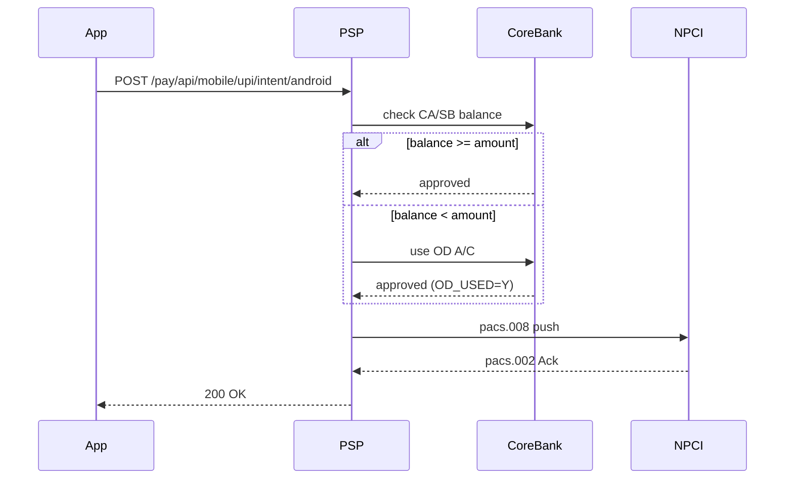
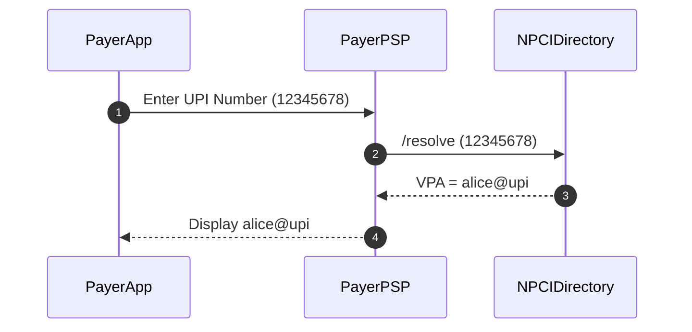

# UPI 2.0 Real-Time Payments – Use-Case Catalogue  
*Version 0.1 – 08 Aug 2025*

---

## Template Legend  

| Field | Meaning |
|-------|---------|
| **Primary Actor** | System/party that starts the interaction |
| **Scope** | System under design (UPI Switch + PSP connectors) |
| **Level** | User goal vs. sub-function |
| **Pre-condition** | What must be true before UC begins |
| **Post-condition** | Guaranteed state after success |
| **Trigger** | Event that kicks off the UC |

---

## UC-01 · P2P Push Payment  

| Item | Details |
|------|---------|
| **Goal** | Transfer funds instantly from payer to payee VPA. |
| **Primary Actor** | **Payer PSP** |
| **Stakeholders** | Payee PSP, NPCI Switch, Core Banking |
| **Scope** | UPI RTP rails |
| **Level** | User goal |
| **Pre-condition** | Payer is device-bound & authenticated; payer balance ≥ amount OR OD enabled. |
| **Trigger** | Payer taps **“Pay”** on mobile-app form. |
| **Post-condition** | Ledger entries posted for both banks; success receipt shown. |
| **Related Reqs** | REQ-001 latency, REQ-003 dup-txn, REQ-013 ISO map, REQ-021 timeout |

### Main Success Scenario
1. **Payer App ➜ Payer PSP** `/upi/intent` (amount, payee VPA, txnId)  
2. **Payer PSP ➜ NPCI** ISO 8583 request  
3. **NPCI ➜ Payee PSP** ISO 8583 credit message  
4. **Payee PSP → Core Bank CBS** Credit customer  
5. **Payee PSP ➜ NPCI** Ack `00`  
6. **NPCI ➜ Payer PSP** Ack `00`  
7. **Payer PSP ➜ Payer App** HTTP 200 + receipt  
8. **Both PSPs** persist pacs.008 & pacs.002 for audit.

### Alternate / Exception Flows
* **E1 – Insufficient funds** Payer CBS returns balance < amount; Payer PSP triggers OD check (REQ-008).  
* **E2 – Duplicate txnId** NPCI detects repeat within 24 h → returns HTTP 409 `DUPLICATE` (REQ-003).  
* **E3 – Switch timeout** Step 2 exceeds 2 s → NPCI sends pacs.002 reject `TIMEOUT` (REQ-021).

## UC-02 · P2M Collect (Dynamic QR)

| Item             | Details                                                                                                                                         |
|------------------|-------------------------------------------------------------------------------------------------------------------------------------------------|
| **Goal**         | Merchant requests payment via dynamic QR; payer approves.                                                                                      |
| **Primary Actor**| Merchant PSP                                                                                                                                   |
| **Stakeholders** | Payer PSP, NPCI, Merchant                                                                                                                      |
| **Pre-condition**| Merchant POS online; QR generated with invoice details.                                                                                        |
| **Post-condition**| Merchant receives credit & callback; payer sees confirmation.                                                                                 |
| **Related Reqs** | REQ-002 ₹2 lakh cap, REQ-019 invoice, REQ-018 name-display                                                                                     |
| **Main Flow**    | (9 steps) mirrors UC-01 but initiated by `/collect/initiate` and finished by `/collect/approve` after payer consent.                          |

## UC-03 · Signed Mandate / AutoPay

| Field             | Details                                                                  |
| ----------------- | ------------------------------------------------------------------------ |
| **Primary Actor** | Payer PSP                                                                |
| **Goal**          | Register & execute recurring debit without OTP for payments ≤ ₹15,000.   |
| **Related Reqs**  | REQ-004, REQ-005, REQ-006, REQ-023                                       |
| **Sequence**      | Mandate setup ➜ NPCI mandate DB ➜ scheduled debit job ➜ success/failure. |

## UC-04 · Overdraft Fallback

| Field             | Details                                                              |
| ----------------- | -------------------------------------------------------------------- |
| **Primary Actor** | **Core Banking**                                                     |
| **Goal**          | Allow payment even if CA/SB balance insufficient by dipping into OD. |
| **Related Reqs**  | REQ-008, REQ-001 (latency unchanged)                                 |

## UC-05 · UPI Number Alias Resolution

| Field             | Details                                                 |
| ----------------- | ------------------------------------------------------- |
| **Primary Actor** | **Payer PSP**                                           |
| **Goal**          | Resolve 8-digit UPI Number to canonical VPA in ≤ 50 ms. |
| **Related Reqs**  | REQ-007                                                 |

##6 · Cross-Reference Table
| UC-ID | Primary Req-IDs           | Sequence Diagram File      |
| ----- | ------------------------- | -------------------------- |
| UC-01 | REQ-001, -003, -013, -021 | embedded                   |
| UC-02 | REQ-002, -018, -019       | embedded                   |
| UC-03 | REQ-004, -005, -006, -023 | TBA (`uc03_mandate.mmd`)   |
| UC-04 | REQ-008                   | TBA (`uc04_overdraft.mmd`) |
| UC-05 | REQ-007                   | embedded                   |

