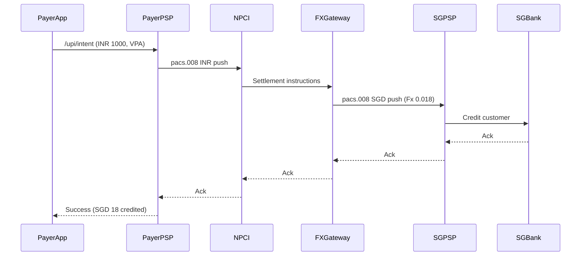

# Business Requirements Document  
## UPI 2.0 Real-Time Payments (RTP)  
**Author:** Sanjay Kumar  

---

### 1 Introduction & Scope  
This document defines the business requirements to implement national real-time push (credit) and pull (collect) payments over UPI 2.0 rails, with one-to-one mapping to ISO 20022 pacs.008/pacs.002 messages.  
**Phase 1** covers domestic INR legs (P2P, P2M dynamic QR, signed mandates, overdraft, VPA alias); **Phase 2** will extend to cross-border corridors and multi-currency support.

---

### 2 Business Context & Drivers  
- **Volume growth:** 19.47 bn UPI txns (₹ 25.1 L Cr) in July 2025, +35 % YoY.  
- **Regulatory push:** NPCI’s Aug 2025 SLA mandates P95 ≤ 2 s and rate-limit controls.  
- **Feature expansion:** Overdraft, signed mandates up to ₹ 15 k without AFA; UPI Number alias.  
- **Strategic goal:** Align domestic RTP data model to ISO 20022 CBPR+ Nov 2025 for seamless cross-border adoption.

*Citations:*  
- NPCI monthly stats   
- NPCI SLA circular Aug 2025   
- RBI e-mandate ₹ 15 k limit 

---

### 3 Stakeholder Analysis  

| Stakeholder        | Role                   | Pain Point / Goal             | Contact Freq. |
|--------------------|------------------------|-------------------------------|---------------|
| Payer PSP          | Initiator (bank/app)   | P95 ≤ 2 s; low fraud          | Daily         |
| Payee PSP          | Receiver (bank/app)    | Guaranteed credit; fee clarity| Daily         |
| NPCI Switch        | Scheme operator        | SLA adherence; settlement     | Real-time     |
| Sponsor Banks      | Settlement accounts    | Net positions; reconciliation | Hourly        |
| Core Banking Teams | Ledger & OD logic      | Atomic posting; fallback      | Weekly        |
| Fraud-Ops          | Risk & reversals       | FP ≤ 0.2 %; rapid reversal    | Ad-hoc        |
| RBI Compliance     | Regulator              | Audit logs; retention         | Monthly       |
| Merchants          | QR issuers             | Invoice detail; confirmation  | Daily         |

---

### 4 Detailed Use-Case Catalogue  
*(Extract from `docs/02_Use_Case_Catalogue.md` or paste here inline with diagrams.)*

| UC-ID | Title                              | Primary Actor | Pages |
|-------|------------------------------------|---------------|-------|
| UC-01 | P2P Push Payment                   | Payer PSP     | 3     |
| UC-02 | P2M Collect (Dynamic QR)           | Merchant PSP  | 3     |
| UC-03 | Signed Mandate / AutoPay           | Payer PSP     | 3     |
| UC-04 | Overdraft Fallback                 | Core Banking  | 2     |
| UC-05 | UPI Number Alias Resolution        | Payer PSP     | 1     |

*(Each UC section includes pre-/post-conditions, main & exception flows, sequence diagrams.)*

---
## User Stories & Acceptance Criteria
| ID    | As a…            | I want to…                                             | So that…                                    | Acceptance Criteria                                                                                                                                                              |
| ----- | ---------------- | ------------------------------------------------------ | ------------------------------------------- | -------------------------------------------------------------------------------------------------------------------------------------------------------------------------------- |
| US-01 | Payer (end-user) | initiate a P2P payment in under 2 s                    | I don’t wait at checkout                    | 1. Given I enter amount & VPA, when I tap “Pay”, then I see success within 2 s (P95).<br>2. A receipt screen appears with txnId & timestamp.                                     |
| US-02 | Merchant (POS)   | display dynamic QR with invoice details for each order | customers scan & pay in one step            | 1. Given an invoice (ID, amount, line-items), when `/collect/initiate` completes, then QR payload includes invoiceId & line-items.<br>2. Merchant receives callback with status. |
| US-03 | Ops (compliance) | download a camt.053 settlement file hourly             | I can reconcile daily volumes automatically | 1. Given each hour ends, when API generates file, then camt.053 XML validates against CBPR+ XSD.<br>2. Filename `settlement_YYYYMMDD_HH.xml` is uploaded to S3.                  |
| US-04 | BA/Product Owner | see a one-page ROI summary of the latency improvements | I can justify further investment            | 1. Given baseline latency of 2.5 s and new P95 of 1.9 s, when I input transaction volume, then the sheet computes time saved × cost per second = annual savings.                 |


## UI Wireframe Sketches
Screen A: P2P Payment Entry
```less
┌──────────── UPI Payment ────────────┐
│ Amount: [ ₹  500.00          ]      │
│ To (VPA): [ merchant@bank   ]       │
│ [ Pay Now ]                         │
└─────────────────────────────────────┘
```
Screen B: Payment Confirmation

``` less
┌────── Success! ──────┐
│ ✅ Transaction Complete     │
│ Txn ID: e7a1f234…           │
│ Amount: ₹500.00             │
│ Time: 2025-08-07 16:15:30   │
│ [ Back to Home ] [ Share ]  │
└────────────────────────────┘

```
Screen C: Dynamic-QR at Merchant POS
```less
┌──── Merchant QR ────┐
│ Invoice # INV-12345     │
│ Amount: ₹1 250.00       │
│ [ QR CODE IMAGE ]       │
│ “Scan with UPI App”     │
└───────────────────────┘
```
## ROI Analysis (Simplified)

| Metric                            | Value              | Notes                                          |
| --------------------------------- | ------------------ | ---------------------------------------------- |
| Avg tx time before (P95)          | 2.50 s             | Pre-project measurement                        |
| Avg tx time after (P95)           | 1.90 s             | Post-project measurement                       |
| Δ per‐tx latency                  | 0.60 s             | 2.50 s − 1.90 s                                |
| Annual UPI tx volume              | 250 billion        | April 2025 YTD (NPCI)                          |
| Total seconds saved per year      | 0.60 s × 250 × 10⁹ | = 150 billion s (\~4 750 years cumulative)     |
| Cost per second of customer time  | ₹0.001 (₹60/hr)    | Back-of-envelope for digital convenience value |
| **Annual value of latency gains** | **₹150 billion**   | 150 × 10⁹ s × ₹0.001 / s                       |

## Phase 2 Cross-Border Flow (Sample)

| Item               | Details                                                             |
| ------------------ | ------------------------------------------------------------------- |
| **Goal**           | Enable Indian payer to push INR to Singapore PayNow receiver.       |
| **Primary Actor**  | Payer PSP                                                           |
| **Scope**          | UPI switch + FX gateway + PayNow scheme                             |
| **Pre-condition**  | Payer has sufficient INR; PSP has FX rate loaded                    |
| **Trigger**        | Payer selects “Send to PayNow” in app                               |
| **Post-condition** | Singapore bank credited; settlement in SGD; audit trail in pacs.008 |




### 5 Non-Functional Requirements  

| NFR-ID | Category       | Metric                    | Target               | Source REQ  |
|--------|----------------|---------------------------|----------------------|-------------|
| NFR-01 | Performance    | P95 end-to-end latency    | ≤ 2 000 ms           | REQ-001     |
| NFR-02 | Throughput     | Burst TPS                 | 5 000 TPS            | REQ-020     |
| NFR-03 | Availability   | Uptime per month          | ≥ 99.95 %            | REQ-026     |
| NFR-04 | Security       | Data-at-rest encryption   | AES-256; rotate 90 d | REQ-011     |
| NFR-05 | Compliance     | Log retention             | ≥ 7 years            | REQ-012     |
| NFR-06 | Disaster Recov. | RPO / RTO                 | 15 min / 60 min      | REQ-027     |

---

### 6 Regulatory & Scheme References  

| Ref     | Title                              | Issuer | Date       |
|---------|------------------------------------|--------|------------|
| RBI-EM15 | RBI e-Mandate ₹ 15 k limit         | RBI    | 08 Jun 2022  |
| NPCI-OC1 | NPCI UPI SLA & rate limits         | NPCI   | 01 Aug 2025  |
| CBPR+   | SWIFT CBPR+ Nov 2025 pacs.008 spec | SWIFT  | Nov 2025  |

---

### 7 Assumptions & Constraints  
- NPCI fees constant FY 25-26.  
- Daily settlement cut-off 23:30 IST; no overnight batch.  
- Phase 1 excludes FX/multi-currency.  
- UPI Intent deep-link spec stable.

---

### 8 Glossary  

| Term                   | Meaning                                            |
|------------------------|----------------------------------------------------|
| UPI                    | Unified Payments Interface                         |
| PSP                    | Payment Service Provider                           |
| VPA                    | Virtual Payment Address (`name@bank`)              |
| pacs.008               | ISO 20022 Customer Credit Transfer message         |
| pacs.002               | ISO 20022 Payment Status Report                    |
| STP                    | Straight-Through Processing                        |
| MoSCoW                 | Must, Should, Could, Won’t prioritization          |


